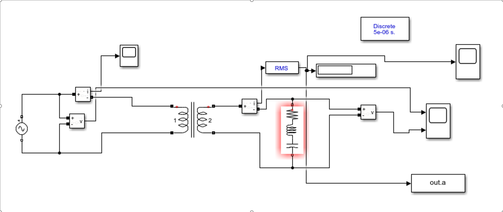
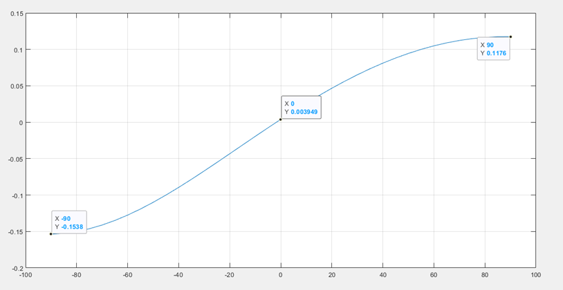
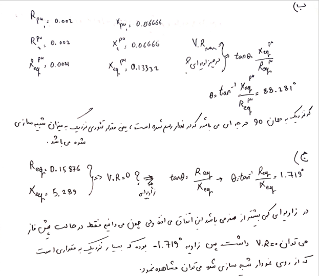
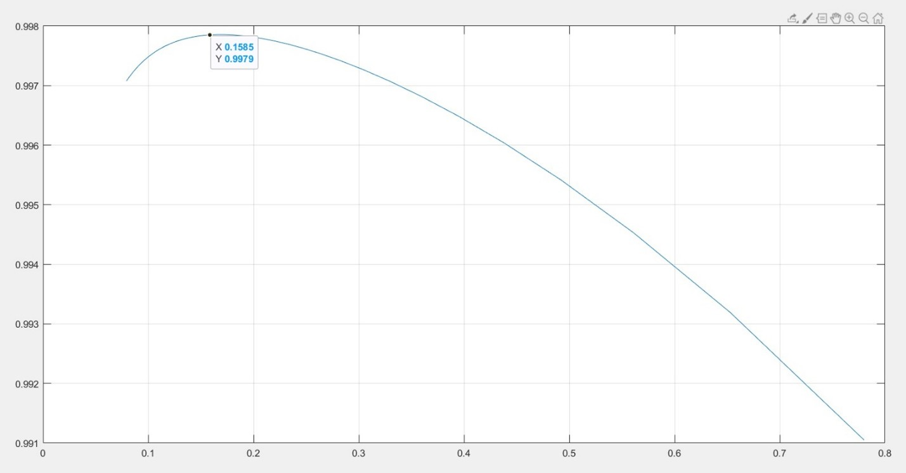

# Single-Phase Transformer Performance Analysis

MATLAB scripts and Simulink models to evaluate the voltage regulation and efficiency characteristics of a linear 250kVA transformer under variable loading conditions. This project was completed as part of the Electrical Machines II curriculum at Shiraz University.

## Project Structure

* `trans.slx` / `codetrans.m`: Simulink workspace and MATLAB driver loop for variable load-angle analysis.
* `trans1.slx` / `codetrans1.m`: Simulink schematic and processing script for resistive load factor variations.
* `images/`: Simulation plots, circuit schematics, and handwritten verification sheets.

## Key Simulation Highlights

### 1. Voltage Regulation vs. Power Factor Angle (Assigned Tasks A, B, C)
* Swept the load phase angle from -90° (pure capacitive) to +90° (pure inductive) in steps of 5° under a rated 250 kVA apparent power profile.
* Dynamically calculated R, L, and C components in MATLAB and pushed variables directly into the Simulink load block.
* Verified simulation milestones against mathematical hand-calculations:
  * **Maximum Regulation (Lagging PF):** Occurs at an inductive load angle of 88.28°.
  * **Zero Regulation (Leading PF):** Achieved at a capacitive load angle of -1.72°.

#### System Block Schematic

#### Simulation Output

---

### 2. Efficiency vs. Load Factor Optimizer (Assigned Tasks D, E)
* Configured an automated loop to sweep a purely resistive load from 50 to 500 Ohms in 10 Ohm increments.
* Logged steady-state secondary and primary voltage/current RMS workspace vectors to map the exact load factor distribution curve.
* **Takeaway:** Proved that peak transformer efficiency (99.79%) occurs at a low load factor of 0.1585 (15.85%), validating the point where copper losses dynamically balance core losses.

#### Hand Derivations & Extrema Proof Sheet

#### Efficiency Distribution Profile

---

## How to Run
1. Open MATLAB and ensure the Simscape Electrical / Power Systems toolbox is active.
2. Run `codetrans.m` to automatically execute the load-angle sweep loop and plot the resulting voltage regulation profile.
3. Run `codetrans1.m` to run the resistive loading iterations and output the load factor vs. efficiency curve.
